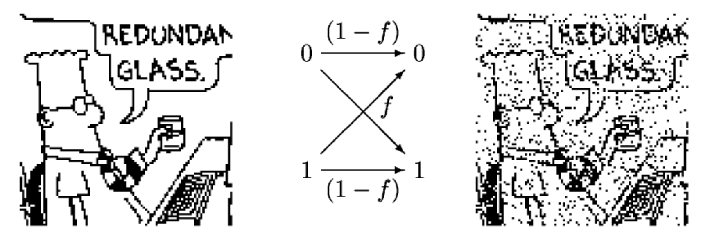
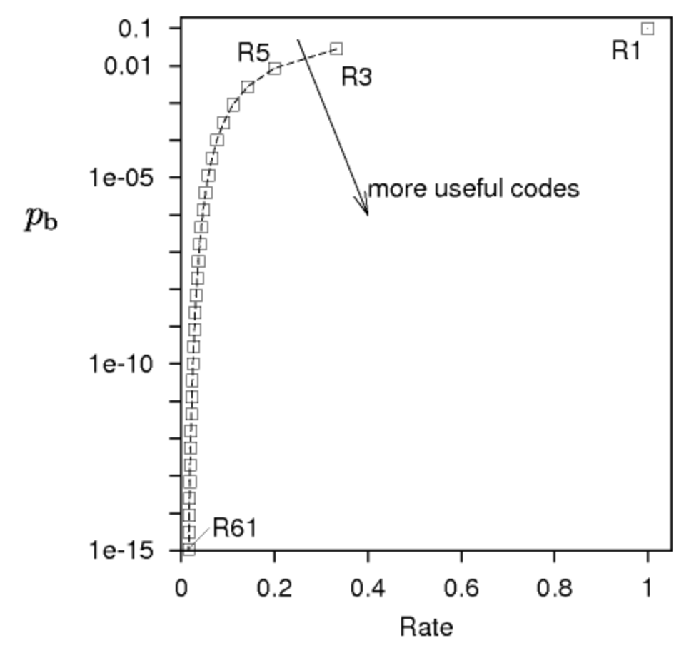
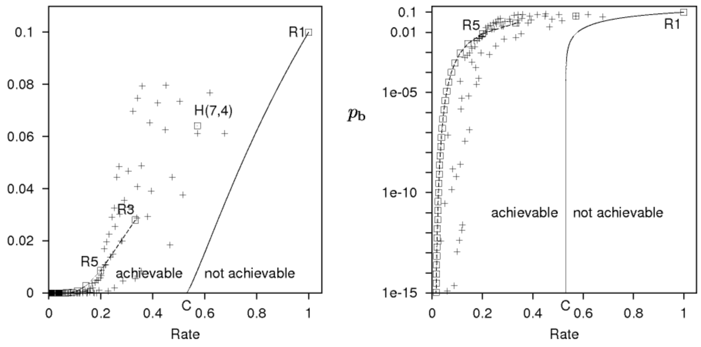

# Lecture 1 - Introduction to Information Theory

[[slides](http://www.inference.org.uk/mackay/itprnn/slides/l1/)]
[[video](http://videolectures.net/mackay_course_01/)]

## The Fundamental Problem
- This field was invented to enable reliable communications over unreliable channels
- Received signal  transmitted signal  noise
- We would like communications where received message  transmitted message

## Solutions
### Physical
- Adapting physics to improve the channel
- e.g. better insulation, adding cooling, etc.

### Systems
- Accepting noise and the unreliable channel
- Adding encoding and decoding to make it reliable

### Encoding
Source   Encoder  Coded Transmission   Channel  Noise   Received Message   Decoder  Decoded Message 

## Binary Symmetric Channels

We will use the binary symmetric channel (BSC) as a toy problem.  is the probability of a single bit being flipped. For all the following problems, we will assume .

## Question 1
_If  bits are stored on a disk drive, and each bit is independently read, how many are flipped?_  
This falls under the binomial distribution, so we have:

## Question 2
_For a saleable 1GB drive, how small does  need to be, assuming the drive is used for 5 years at 1GB/day?_

But if we want a  chance of dissapointment, we will need to set .  
To have  happy customers under this new constraint, we will further neet to set . This is usually the standard in industry.

We will aim for  for now.

## Example Encoders
### Parity Coding
- Set a parity bit  as the sum of some preceding bits 
-  would have parity bit  appended to it

### Repetition Codes
- Repeat the source message a number of times

For :

The decoder under this scheme is a simple majority voting decoder (MVD):

And here is a worked example:

Repetition codes work, but they are not good enough for . We'll see why below.

## Inference
1. Product Rule: 
2. Sum Rule: 

From the above two rules, we can try solving for the posterior probability of :

Note that we refer to  as the likelihood of , and  as the prior probability of .

### Question 3
_If we receive , what are the probabilities for the source message?_

We first calculate the likelihoods of :

We can also place a prior , and calculate the posterior straightforwardly:

, so we have verified that this scheme produces the best choice ().

## Forward Probability
We have so far described this system:

What is the probability that  for a single bit ()?  
This would only happen when there are 2 or 3 flips in a block.

## Question 4
_For , what  is needed to deliver  under our system?_  

As we add more repetition, we also proportionally reduce the rate of the channel (i.e. the effective data transmission throughput).

## 7,4 Hamming Code
Going back to the idea of using parity bits, we add 3 parity bits for every 4 source bits, as follows:  
Select  such that the parity of  is even.  
Select  such that the parity of  is even.  
Select  such that the parity of  is even.

The decoding process is:  
1. Find the groups which are not of even parity.
2. Find the bit which is inside the incorrect groups, but outside the correct groups.
3. Correct the suspected flipped bit.

### Example

Under this system, any single bit flip is detected and corrected. However, if two or more flips occur, then .

Additionally, for this system it is known that  and .

What is achievable from an encoder-decoder system however? Conventional understanding was that some boundary passing through the origin existed; Shannon proved that for every channel, the boundary actually intersects the x-axis at a non-zero point. This rate is called the capacity  of the channel in question.

 is the binary entropy function.

This is Shannon's Noisy Channel Coding Theorem, and proving this will be the focus of the next few lectures.

_All figures are from the linked slides for this lecture._
