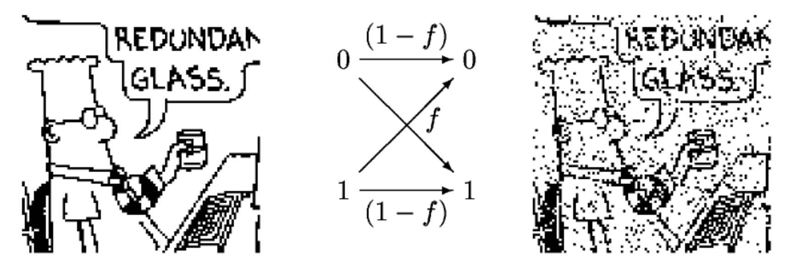
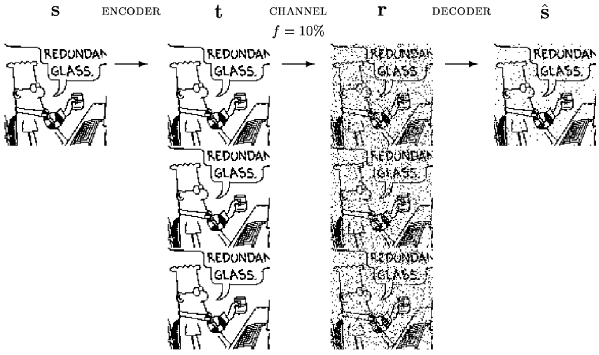
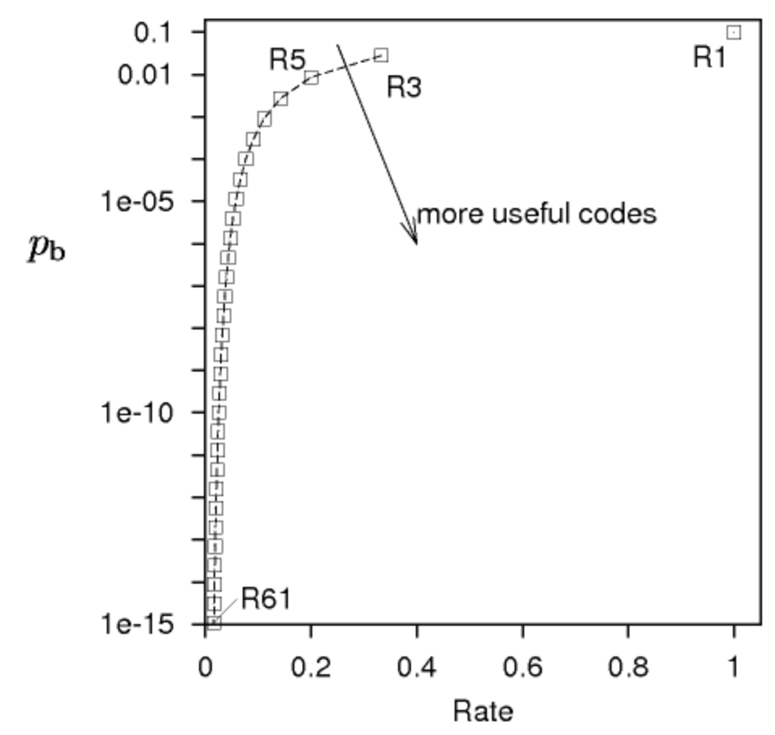
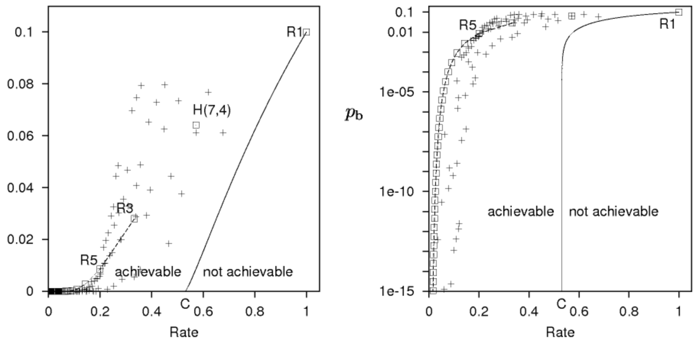

# Lecture 1 - Introduction to Information Theory

[[slides](http://www.inference.org.uk/mackay/itprnn/slides/l1/)]
[[video](http://videolectures.net/mackay_course_01/)]

## The Fundamental Problem
- This field was invented to enable reliable communications over unreliable channels
- Received signal $\simeq$ transmitted signal $+$ noise
- We would like communications where received message $=$ transmitted message

## Solutions
### Physical
- Adapting physics to improve the channel
- e.g. better insulation, adding cooling, etc.

### Systems
- Accepting noise and the unreliable channel
- Adding encoding and decoding to make it reliable

### Encoding
Source $\underline{s}$ $\rightarrow$ Encoder $\rightarrow$ Coded Transmission $\underline{t}$ $\rightarrow$ Channel $+$ Noise $\underline{n}$ $\rightarrow$ Received Message $\underline{r}$ $\rightarrow$ Decoder $\rightarrow$ Decoded Message $\underline{\hat{s}}$

## Binary Symmetric Channels

We will use the binary symmetric channel (BSC) as a toy problem. $f$ is the probability of a single bit being flipped. For all the following problems, we will assume $f = 0.1$.

$$\begin{aligned} P(y=0 | x=0) &= 1-f \\
P(y=1 | x=0) &= f \\
P(y=0 | x=1) &= f \\
P(y=1 | x=1) &= 1-f
\end{aligned}$$

## Question 1
_If $10000$ bits are stored on a disk drive, and each bit is independently read, how many are flipped?_  
This falls under the binomial distribution, so we have:

$$\begin{aligned}
\mu &= np = 10000 \times 0.1 = 1000 \\
\sigma^2 &= npq = 1000 \times 0.1 \times 0.9 = 900
\end{aligned}$$

## Question 2
_For a saleable 1GB drive, how small does $f$ need to be, assuming the drive is used for 5 years at 1GB/day?_

$$ \begin{aligned} \#\text{bits} & = 5 \times 365 \times 8 \times 10^9\ \text{bits} \\
& \approx 10^{13}\ \text{bits} \end{aligned}$$

But if we want a $1\%$ chance of dissapointment, we will need to set $f \simeq 10^{-15}$.  
To have $1000$ happy customers under this new constraint, we will further neet to set $f \simeq 10^{-18}$. This is usually the standard in industry.

We will aim for $f \simeq 10^{-15}$ for now.

## Example Encoders
### Parity Coding
- Set a parity bit $p$ as the sum of some preceding bits $s$
- $01011101$ would have parity bit $1$ appended to it

### Repetition Codes
- Repeat the source message a number of times

For $R_3$:

$$\begin{aligned}
s &\rightarrow t \\
0 &\rightarrow 000 \\
1 &\rightarrow 111
\end{aligned}$$

The decoder under this scheme is a simple majority voting decoder (MVD):

$$\begin{aligned}
r &\rightarrow \hat{s} \\
000 &\rightarrow 0 \\
001 &\rightarrow 0 \\
110 &\rightarrow 1 \\
111 &\rightarrow 1
\end{aligned}$$

And here is a worked example:

$$\begin{aligned}
s &= 0\ 1\ 1\ 0\ 1 \\
t &= 000\ 111\ 111\ 000\ 111 \\
n &= 000\ 100\ 000\ 101\ 000\quad &\text{(1 causes a flip)} \\
r &= 000\ 011\ 111\ 101\ 111 \\
\hat{s} &= 0\ 1\ 1\ 1\ 1\quad &\text{(error in 4th bit)}
\end{aligned}$$

Repetition codes work, but they are not good enough for $f \simeq 10^{-15}$. We'll see why below.

## Inference
1. Product Rule: $P(s,r) = P(s)P(r|s) = P(r)P(s|r)$
2. Sum Rule: $P(r) = \sum_{s}P(s,r) = P(s=0|r) + P(s=1|r)$

From the above two rules, we can try solving for the posterior probability of $s$:

$$P(s|r) = \frac{P(r|s)P(s)}{P(r)}$$

Note that we refer to $P(r|s)$ as the likelihood of $s$, and $P(s)$ as the prior probability of $s$.

### Question 3
_If we receive $r = 011$, what are the probabilities for the source message?_

We first calculate the likelihoods of $s$:

$$\begin{aligned}
P(r|s=0) &= f^2(1-f)\quad \text{(2 bits flipped)} \\
P(r|s=1) &= f(1-f)^2\quad \text{(1 bit flipped)}
\end{aligned}$$

We can also place a prior $P(s=0) = P(s=1) = 0.5$, and calculate the posterior straightforwardly:

$$\begin{aligned}
P(s=1|r=011) &= \frac{f(1-f)^2 \times 0.5}{f(1-f)^2 \times 0.5 + f^2(1-f) \times 0.5} \\
&= 1-f = 0.9
\end{aligned}$$

$P(s=1|r) > P(s=0|r)$, so we have verified that this scheme produces the best choice ($\hat{s} = 1$).

## Forward Probability
We have so far described this system:

$$s \xrightarrow{R_3} t \xrightarrow[f]{BSC} MVD \rightarrow \hat{s}$$

What is the probability that $P(\hat{s} \neq s)$ for a single bit ($P_b$)?  
This would only happen when there are 2 or 3 flips in a block.

$$P(\hat{s} \neq s) = f^3 + 3f^2(1-f) \approx 3f^2 $$

## Question 4
_For $R_N$, what $N$ is needed to deliver $P_b \approx 10^{-15}$ under our system?_  
$N = 61$

As we add more repetition, we also proportionally reduce the rate of the channel (i.e. the effective data transmission throughput).

## 7,4 Hamming Code
Going back to the idea of using parity bits, we add 3 parity bits for every 4 source bits, as follows:  
Select $t_5$ such that the parity of $s_1 + s_2 + s_3 + t_5$ is even.  
Select $t_6$ such that the parity of $s_2 + s_3 + s_4 + t_6$ is even.  
Select $t_7$ such that the parity of $s_1 + s_3 + s_4 + t_7$ is even.

The decoding process is:  
1. Find the groups which are not of even parity.
2. Find the bit which is inside the incorrect groups, but outside the correct groups.
3. Correct the suspected flipped bit.

### Example
$$\begin{aligned}
s &= 1000 \\
t &= 1000\ 101 \\
n &= 0100\ 000\quad \text{(1 causes a flip)} \\
r &= 1100\ 101 \\
\hat{t} &= 1000\ 101\quad \text{(flipped bit corrected)} \\
\hat{s} &= 1000\quad
\end{aligned}$$

Under this system, any single bit flip is detected and corrected. However, if two or more flips occur, then $\hat{s} \neq s$.

Additionally, for this system it is known that $p_{block\ error} \simeq 21f^2$ and $p_b \simeq 9f^2$.

What is achievable from an encoder-decoder system however? Conventional understanding was that some boundary passing through the origin existed; Shannon proved that for every channel, the boundary actually intersects the x-axis at a non-zero point. This rate is called the capacity $C$ of the channel in question.

$$C_{BSC(f)} = 1 - H_2(f)$$
$$H_2(f) = f\log_2\frac{1}{f} + (1-f)\log_2\frac{1}{1-f}$$

$H_2$ is the binary entropy function.

This is Shannon's Noisy Channel Coding Theorem, and proving this will be the focus of the next few lectures.

_All figures are from the linked slides for this lecture._
